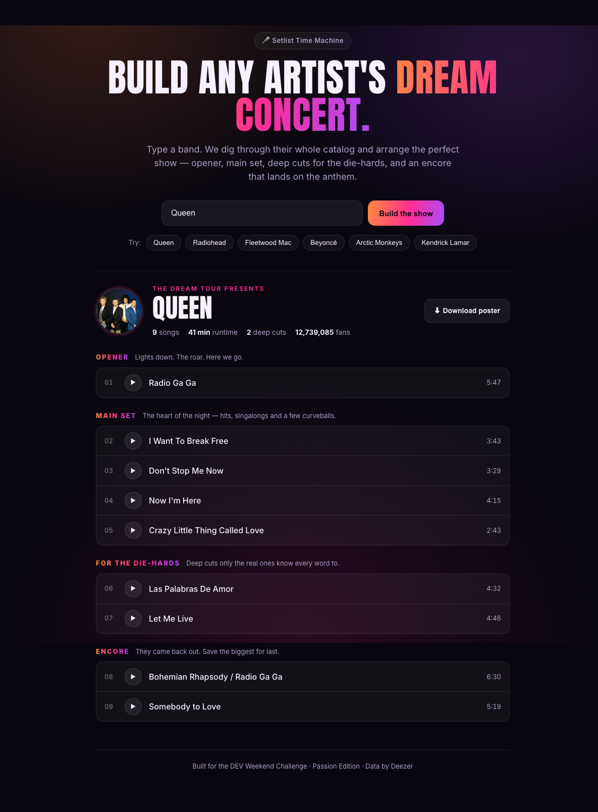

# 🎤 Setlist Time Machine

**Type any artist and instantly get their _dream concert_ — opener, main set, deep cuts for the die-hards, and an encore that lands on the anthem — as a shareable poster.**

Built for the [DEV Weekend Challenge: Passion Edition](https://dev.to/challenges/weekend-2026-07-09). Because there is no purer expression of passion than the setlist you'd kill to hear your favorite band play.

🔗 **Live demo:** https://setlist-time-machine-644564019699.us-central1.run.app



---

## What it does

1. You search an artist.
2. It pulls their **entire catalog** from Deezer's public API — not just the hits, but every album track.
3. A curation algorithm arranges those songs into the arc of a real concert:
   - **Opener** — a big, recognizable, high-energy song.
   - **Main Set** — hits and singalongs, sequenced with dynamics (peaks and valleys, not a flat popularity slide).
   - **For the Die-Hards** — genuine deep cuts pulled from the lower-popularity band of the studio albums.
   - **Encore** — the biggest anthems, closing on the #1 song of all.
4. You can **play 30-second previews** of every track, and **download a concert-poster PNG** to share.

## Tech

- **Frontend:** React 19 + Vite, hand-rolled CSS (concert-poster aesthetic, self-hosted fonts).
- **Backend:** Node + Express — proxies the Deezer API (dodges CORS), runs the setlist algorithm, and serves the built SPA.
- **Poster export:** `html-to-image` rasterises an off-screen poster node; a same-origin image proxy keeps the `<canvas>` untainted by Deezer's CDN.
- **Data:** [Deezer public API](https://developers.deezer.com/api) — no API key required.
- **Deploy:** Docker → Google Cloud Run.

No API keys, no secrets, no database.

## Run locally

```bash
npm install
npm run dev      # Vite on :5173, API on :8787 (proxied)
```

Or run the production build exactly as it ships:

```bash
npm run build
npm start        # http://localhost:8787
```

## Deploy to Google Cloud Run

No local Docker needed — Cloud Build builds the image from the `Dockerfile`:

```bash
gcloud run deploy setlist-time-machine \
  --source . \
  --region us-central1 \
  --allow-unauthenticated
```

The app reads `PORT` from the environment (Cloud Run sets it automatically).

## How the setlist algorithm works

See [`server/setlist.js`](server/setlist.js). In short:

- The **hits** bucket (Deezer's curated "top tracks") drives the opener, main set, and encore.
- The **deep** bucket (studio-album tracks that aren't hits, filtered to real songs) fills the die-hard section — picked from the ~35th percentile down so they're obscure but not filler/interludes.
- The main set is **zig-zagged** (alternating high/low popularity) so the energy rises and dips like a real show instead of decaying monotonically.
- The single biggest song is always saved for the **encore finale**.

## Credits

Music data by [Deezer](https://www.deezer.com). Built with 🎧 for the DEV community.
